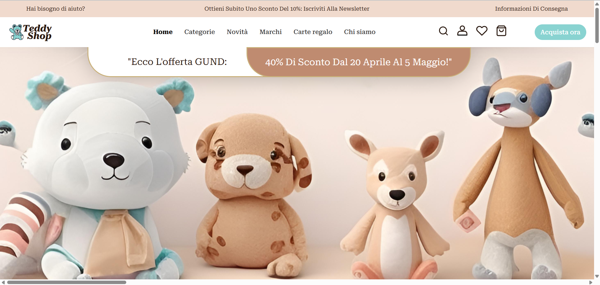

Projeto disponível: https://arianewelke.github.io/E-commerce-ChallengeUOL/

# Projeto E-commerce - Desafio 3 Compass UOL

Este projeto foi desenvolvido como parte de um desafio da Compass UOL, com o objetivo de avaliar a resolução de problemas, a utilização de ferramentas necessárias e a assertividade frente às demandas solicitadas. O projeto consiste em um site e-commerce desenvolvido utilizando apenas HTML, CSS e JavaScript, seguindo um layout fornecido no Figma.

## Visão Geral

O projeto foi desenvolvido no Visual Studio Code (VSCode) e implementa as funcionalidades básicas de um site e-commerce, incluindo a exibição de produtos, navegação entre categorias, e uma interface de usuário responsiva.

## Funcionalidades

- **Página Inicial**: Exibe os produtos em destaque e categorias principais.
- **Navegação por Categorias**: Permite separar produtos por categorias específicas.
- **Responsividade**: O site é totalmente responsivo, adaptando-se a diferentes tamanhos de tela.

## Tecnologias Utilizadas

- **HTML**: Estruturação do conteúdo da página.
- **CSS**: Estilização e layout responsivo.
- **JavaScript**: Funcionalidades interativas e dinâmicas.

## Como Executar o Projeto

1. **Clone o repositório**:
   ```bash
   git clone https://github.com/seu-usuario/seu-repositorio.git
   
2. **Navegue até o diretório do projeto**:
   ```bash
   cd seu-repositorio

3. **Abra o projeto no VSCode e execute o projeto:**
```bash
 Abra o arquivo index.html no seu navegador.
